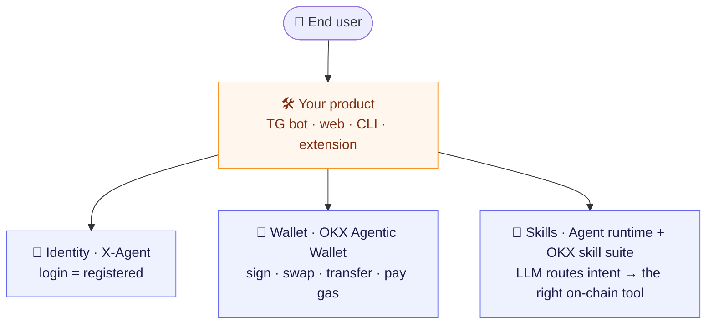

<div align="center">

# X-Agent

### The crypto-native AI app builder

**Describe an app in plain language — ship a live product with a wallet, on-chain payments, and DeFi superpowers baked in.**

[](https://github.com/xagent-labs/xagt-plugin)
[](https://github.com/xagent-labs/xagt-plugin)

[](#)
[](#)
[](#)
[](#)
[](#)

</div>

---

## What is X-Agent?

X-Agent turns natural language into **live, on-chain-ready apps**. Where most AI builders stop at a web app, every X-Agent project ships pre-wired with the things crypto products actually need: a **user identity**, an **agentic wallet** that can sign and swap, **micropayments and a ledger**, and an **LLM that routes intent to real on-chain actions**.

You write the experience. The wallet, the signing, the multi-chain plumbing, and the agent intelligence are already connected.

## Quick start

One command. A browser opens, you log in (that registers you), and the OKX skill suite installs into your agent.

```bash
npx @xagt/agent-plugin@latest setup --target all
```

Prefer a global install?

```bash
npm i -g @xagt/agent-plugin
xagt-plugin setup --target all
```

Verify everything is wired up:

```bash
xagt-plugin doctor
```

> Requires Node `>= 18.17`. Targets: `cursor`, `claude-code`, `generic` (AgentSkills / OpenClaw), or `all`.

## What your agent gets out of the box

Once installed, your agent (Cursor / Claude Code / OpenClaw / any AgentSkills runtime) can:

- 🔄 **Swap tokens** across 500+ DEXs on 20+ chains — XLayer, Solana, Ethereum, Base, BSC, Arbitrum, Polygon…
- 👛 **Read any wallet** — balances, holdings, PnL, trade history
- 🌾 **Discover DeFi yield** — APY, TVL, lend, borrow, stake, claim, CLMM positions
- 🔍 **Scan meme launches** — dev rug history, bundle/sniper detection, bonding-curve progress
- 🐋 **Track smart money** — leaderboards, KOL trade feeds, aggregated whale signals
- 🛡️ **Pre-flight transactions** — token risk, honeypot detection, phishing-dApp scan, signature safety
- 📈 **Get live market data** — prices, K-lines, OHLC, holder-cluster analysis
- 🧭 **Route to dApps** — Polymarket, Aave V3, Hyperliquid, PancakeSwap, Morpho

## How it fits together



Three of the four layers are already wired — **identity**, **wallet/writes**, and **intelligence**. You build the fourth: the product.

## Repositories

| Repository | What it is |
| --- | --- |
| [**xagt-plugin**](https://github.com/xagent-labs/xagt-plugin) | One-command CLI that registers you and installs the OKX agentic skill suite into your AI coding agent. The fastest way to start building on X-Agent × OKX. |

## Build ideas to riff on

- **AI trading Telegram bot** — "buy $100 of any meme the top 10 KOLs bought in the last hour, max 5% slippage."
- **DeFi auto-rebalancer** — agent watches your portfolio and proposes moves when APY drifts.
- **Rug-proof swap UI** — every quote runs a security scan first; honeypots blocked automatically.
- **Onchain news desk** — a 6 a.m. digest of every overnight smart-money signal.
- **Cross-chain arbitrage scout** — finds price gaps the aggregator hasn't priced in yet.

The agent does the on-chain work. You design the experience.

---

<div align="center">
<sub>Powered by OKX OnchainOS · Built for builders</sub>
</div>

